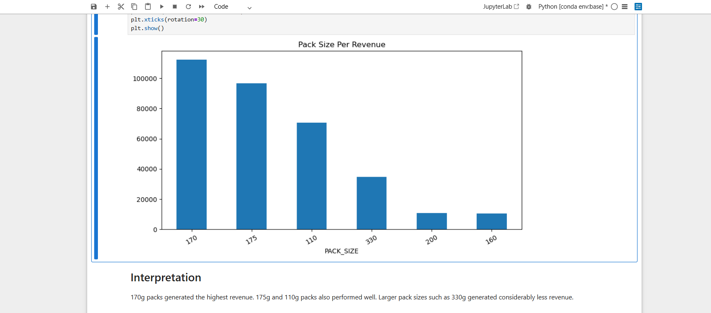
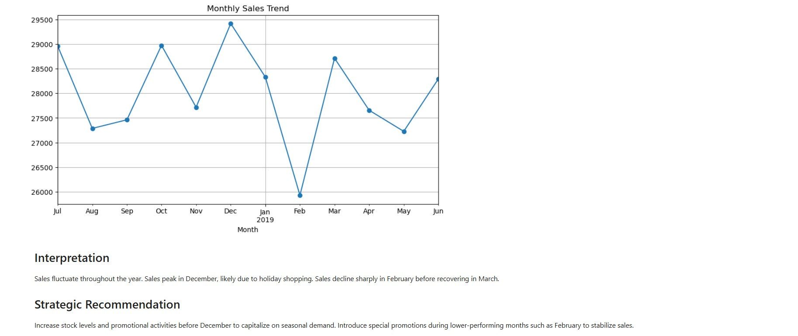

# Quantium Chips Customer & Purchasing Analysis
## Project Overview
This project analyzes chip purchasing behaviour using transaction and customer demographic data.
The objective was to understand customer purchasing patterns, identify high-value customer segments, evaluate product and pack-size performance, and uncover sales trends that can support better marketing, inventory, and promotional decisions.
The analysis was completed using **Python and Jupyter Notebook**, with Pandas, Matplotlib, and Seaborn used for data manipulation and visualization.

## Business Objective
The analysis aimed to answer key business questions:
- Which customer segments generate the most revenue?
- Which customer groups purchase chips most frequently?
- Which customer type contributes the most sales?
- Which chip brands and products perform best?
- Which pack sizes generate the most revenue?
- How do sales change over time?
- Is there a relationship between quantity purchased and sales?
- Which brands perform strongly across different customer life stages?

## Dataset

The project uses two datasets:

### 1. Transaction Data

The transaction dataset contains **264,836 records** and includes:

- Date
- Store Number
- Loyalty Card Number
- Transaction ID
- Product Number
- Product Name
- Product Quantity
- Total Sales

### 2. Customer Data

The customer dataset contains **72,637 customer records** and includes:

- Loyalty Card Number
- Life Stage
- Premium Customer Segment

The two datasets were combined using the **Loyalty Card Number**.

## Data Cleaning & Preparation
The following data preparation steps were performed:
- Checked the structure and data types of the datasets
- Checked for missing values
- Checked for duplicate records
- Removed duplicate records
- Removed missing values
- Standardized product names by removing unnecessary spaces
- Standardized customer life-stage values
- Filtered the transaction data to focus on chip products
- Extracted product pack size from product names
- Extracted brand names from product names
- Created a Month field for time-series analysis
- Merged transaction and customer datasets

## Feature Engineering
Several useful analytical features were created:

### Pack Size
Pack sizes were extracted from product names, including:
- 110g
- 160g
- 170g
- 175g
- 200g
- 330g

### Brand
Brand names were extracted from the product name.

### Month
Transaction dates were converted into monthly periods to analyze sales trends over time.

## Key Business Metrics
After cleaning and preparing the data:

| Metric | Result |

| Total Sales | $335,957.30 |
| Total Transactions | 49,712 |
| Total Quantity Sold | 94,874 packs |
| Unique Customers | 34,281 |
| Average Spend per Customer | $9.80 |
| Average Spend per Transaction | $6.76 |
| Average Quantity per Transaction | 1.91 packs |
| Average Price per Pack | $3.54 |

## Customer Segmentation Analysis

### Sales by Customer Life Stage
| Life Stage | Total Sales |

| Older Singles/Couples | $69,934.10 |
| Retirees | $63,348.90 |
| Older Families | $61,508.90 |
| Young Families | $55,025.10 |
| Young Singles/Couples | $45,609.70 |
| Midage Singles/Couples | $31,923.20 |
| New Families | $8,607.40 |

### Key Finding
**Older Singles/Couples** generated the highest total sales at approximately **$69,934**, making them the highest-value life-stage segment by total revenue.

**New Families** generated the lowest total sales at approximately **$8,607**.

### Recommendation
Prioritize retention and loyalty strategies for high-performing segments such as Older Singles/Couples, Retirees, and Older Families.

For New Families, targeted introductory offers, family-oriented promotions, and bundled products could help increase purchasing frequency.

## Customer Type Analysis
Customers were classified into:
- Budget
- Mainstream
- Premium

### Total Sales
| Customer Type | Total Sales |
|---|---:|
| Mainstream | $130,709.10 |
| Budget | $118,019.40 |
| Premium | $87,228.80 |

### Key Finding
**Mainstream customers generated the highest total sales**, followed by Budget customers.

Premium customers generated the lowest total revenue among the three customer groups.

### Recommendation
Continue prioritizing Mainstream customers while developing targeted strategies to increase purchase frequency and basket size among Premium customers.

## Brand Performance
The analysis compared total quantity purchased and revenue across chip brands.

### Quantity Purchased by Brand
**| Brand | Quantity Sold |**
| Thins | 26,929 |
| Cobs | 18,571 |
| Doritos | 18,178 |
| Smiths | 17,287 |
| WW | 11,266 |
| French | 2,643 |

### Revenue by Brand
**| Brand | Revenue |**
| Thins | $88,852.50 |
| Doritos | $79,974.40 |
| Cobs | $70,569.80 |
| Smiths | $67,226.20 |
| WW | $21,405.40 |
| French | $7,929.00 |

### Key Finding
**Thins was the strongest-performing brand by total revenue and quantity sold.**

Doritos and Cobs were also strong contributors to overall sales.

French and WW recorded substantially lower revenue.

### Recommendation
Maintain strong inventory and promotional support for high-performing brands such as Thins, Doritos, and Cobs.

Investigate the reasons for weaker performance among lower-selling brands and consider targeted promotions or product positioning strategies.

## Pack Size Analysis
Revenue by pack size was analyzed to identify the most valuable pack sizes.

**| Pack Size | Revenue |**
| 170g | $112,396.40 |
| 175g | $96,781.50 |
| 110g | $70,569.80 |
| 330g | $34,804.20 |
| 200g | $10,757.80 |
| 160g | $10,647.60 |

### Key Finding

**170g packs generated the highest revenue**, followed by 175g and 110g packs.

### Recommendation
Prioritize inventory and shelf placement for high-performing pack sizes, particularly 170g and 175g.

Larger and lower-performing pack sizes should be reviewed to determine whether pricing, positioning, or customer demand is affecting performance.

## Sales Trend Analysis
Monthly sales were analyzed to identify seasonal purchasing patterns.

### Key Findings
- Sales fluctuate throughout the year.
- **December recorded the highest sales period.**
- Sales declined sharply in February before recovering in March.
- The results indicate potential seasonal purchasing behaviour.

### Recommendation
Increase inventory and promotional activity before December to take advantage of increased seasonal demand.

Consider targeted promotions during weaker periods such as February to help stabilize sales.


## Purchase Quantity vs Sales
A scatter plot was used to examine the relationship between purchase quantity and total sales.

### Key Finding
There is a clear positive relationship between quantity purchased and total sales.

Customers purchasing more packs generally generate higher transaction values.

### Recommendation
Use multi-buy promotions, bundles, and volume-based offers to encourage customers to purchase multiple packs and increase average transaction value.

## Brand vs Customer Life Stage
A heatmap was created to analyze brand purchasing behaviour across different customer life stages.

### Key Findings
- Thins performed strongly across multiple customer life stages.
- Older Singles/Couples, Retirees, and Older Families showed strong purchasing activity.
- New Families showed relatively low purchasing activity across brands.
- Customer preferences vary across life stages.

### Recommendation
Develop customer-segment-specific marketing strategies rather than using a one-size-fits-all approach.

Promote high-performing brands such as Thins to high-value customer groups while creating targeted campaigns to increase engagement among lower-performing segments.

## Visualizations
The project includes visualizations covering:

### Revenue by Pack Size



### Brand vs Customer Life Stage


- ### Monthly Sales Trend



## Tools & Technologies

- **Python**
- **Jupyter Notebook**
- **Pandas**
- **NumPy**
- **Matplotlib**
- **Seaborn**
- **Data Cleaning**
- **Feature Engineering**
- **Customer Segmentation**
- **Exploratory Data Analysis**
- **Data Visualization**
- **Business Analytics**

## Project Files
## File Description
Forage chips.ipynb
Complete Python/Jupyter Notebook containing the analysis
cleaned_chip_data.csv
Cleaned and feature-engineered dataset
images/
Project charts and visualizations

## Overall Business Recommendations
Based on the analysis:
Prioritize high-value customer segments, particularly Older Singles/Couples, Retirees, and Older Families.
Maintain strong inventory for high-performing brands, especially Thins, Doritos, and Cobs.
Prioritize 170g and 175g packs, which generated the highest revenue.
Use seasonal planning, especially before the December sales peak.
Introduce targeted promotions for lower-performing customer segments.
Use multi-buy and bundle offers to increase purchase quantities and transaction value.
Segment marketing campaigns by customer life stage to better match customer purchasing behaviour.

## Conclusion
This project demonstrates how customer transaction data can be transformed into actionable business insights.
Through data cleaning, feature engineering, customer segmentation, product analysis, and visualization, the analysis identified the customer groups, brands, pack sizes, and purchasing patterns that contribute most to chip sales.
The findings can support better decisions around marketing, inventory planning, promotions, customer retention, and product strategy.

## Author
Oluwadamilola Oluwatosin
Data Analyst | Python | SQL | Power BI | Excel | Data Visualization

## Analysis Workflow

```text
Raw Transaction Data
        ↓
Data Exploration
        ↓
Data Cleaning
        ↓
Feature Engineering
        ↓
Customer & Transaction Data Merge
        ↓
Business Metrics
        ↓
Customer Segmentation
        ↓
Product & Brand Analysis
        ↓
Sales Trend Analysis
        ↓
Data Visualization
        ↓
Business Insights
        ↓
Strategic Recommendations


